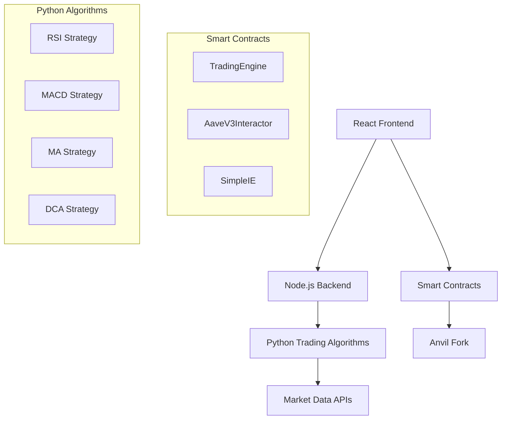

# 🚀 Stratos

An advanced AI-powered cryptocurrency trading platform featuring three specialized assistants for seamless blockchain interactions. Built with React, Node.js, Python, and Solidity smart contracts.

**🌐 Live Demo**: [https://foundryup-frontend.vercel.app/](https://foundryup-frontend.vercel.app/)

---

## 🎯 Overview

AI Quant Trader is a comprehensive DeFi platform that combines artificial intelligence with quantitative trading strategies. Users can interact with blockchain protocols through natural language commands, execute sophisticated trading algorithms, and manage DeFi positions—all through an intuitive chat interface.

---

## ✨ Features

### 🤖 Three Specialized AI Assistants

#### 1. **General Assistant** 
**Send & Swap Made Simple**
- 💸 **Send Tokens**: Transfer ETH and ERC-20 tokens to any address
- 🔄 **Token Swaps**: Swap between different cryptocurrencies via Uniswap integration
- 🎯 **Natural Language**: Use commands like "send 1 ETH to 0x..." or "swap 100 USDC for WETH"

#### 2. **DeFi Assistant**
**Aave Protocol Integration**
- 🏦 **Deposit**: Earn yield by depositing assets into Aave lending pools
- 💰 **Borrow**: Take loans against your collateral
- 📤 **Withdraw**: Remove your deposits from lending pools
- 💳 **Repay**: Pay back borrowed amounts
- 📊 **Commands**: Simple chat commands like "deposit 1000 USDC" or "borrow 0.5 WETH"

#### 3. **Trading Assistant**
**Advanced Quantitative Trading Algorithms**

| Algorithm | Risk Level | Term | Strategy |
|-----------|------------|------|----------|
| **RSI** | High | Short | Relative Strength Index momentum trading |
| **MACD** | High | Long | Moving Average Convergence Divergence |
| **Moving Average** | Low | Short | MA crossover signals |
| **DCA** | Low | Long | Dollar Cost Averaging |

**Features:**
- 📈 **Real-time Signals**: Live trading signals from Python-based algorithms
- ⚡ **Auto-execution**: One-click trade execution with slippage protection
- 🛡️ **Risk Management**: Configurable risk levels and position sizing
- 📊 **Portfolio Tracking**: Real-time balance and performance monitoring

---

## 🏗️ Architecture



---

## 🚀 Getting Started

### Prerequisites

- **Node.js** (v16 or higher)
- **Python** (v3.8 or higher) 
- **Foundry** (for smart contract development)
- **MetaMask** or compatible Web3 wallet

### Local Development Setup

#### 1. Clone the Repository
```bash
git clone https://github.com/your-username/AI-Quant-Trader.git
cd AI-Quant-Trader
```

#### 2. Install Dependencies

**Frontend:**
```bash
cd frontend
npm install
```

**Backend:**
```bash
cd backend
npm install
```

**Python Environment:**
```bash
cd backend/Python
python -m venv myenv
source myenv/bin/activate  # On Windows: myenv\Scripts\activate
pip install -r requirements.txt
```

#### 3. Smart Contract Setup

**Install Foundry:**
```bash
curl -L https://foundry.paradigm.xyz | bash
foundryup
```

**Compile Contracts:**
```bash
forge build
```

#### 4. Start Local Anvil Chain
```bash
anvil --fork-url https://eth-mainnet.g.alchemy.com/v2/YOUR_ALCHEMY_KEY
```

#### 5. Deploy Contracts
```bash
forge script script/DeployAll.sol --rpc-url http://127.0.0.1:8545 --private-key 0xac0974bec39a17e36ba4a6b4d238ff944bacb478cbed5efcae784d7bf4f2ff80 --broadcast
```

#### 6. Start Development Servers

**Python Trading Servers:**
```bash
cd backend/Python
python main.py  # Starts servers on ports 5049-5052
```

**Node.js Backend:**
```bash
cd backend
npm start  # Starts on port 3001
```

**React Frontend:**
```bash
cd frontend
npm start  # Starts on port 3000
```

#### 7. Configure MetaMask
- Add local network: RPC URL `http://127.0.0.1:8545`, Chain ID `31337`
- Import test account with private key: `0xac0974bec39a17e36ba4a6b4d238ff944bacb478cbed5efcae784d7bf4f2ff80`

---

## 🌐 Production Deployment

### Live Application
- **Frontend**: [https://foundryup-frontend.vercel.app/](https://foundryup-frontend.vercel.app/)
- **Anvil Instance**: [https://anvil-mainnet-fork.onrender.com](https://anvil-mainnet-fork.onrender.com)
- **Backend Servers**: Deployed on Render

### Important Notes
⚠️ **Server Limitations**: Backend servers may go down after 15 minutes of inactivity due to Render's free tier limitations. If contracts become unresponsive, they may need to be redeployed. In that case prefer building on local for testing.


---

## 🛠️ Tech Stack

### Frontend
- **React** - User interface
- **Web3.js** - Blockchain interactions
- **Tailwind CSS** - Styling
- **Spline** - 3D animations

### Backend
- **Node.js** - API server
- **Express** - Web framework
- **Python** - Trading algorithms
- **NumPy/Pandas** - Data analysis

### Blockchain
- **Solidity** - Smart contracts
- **Foundry** - Development framework
- **Anvil** - Local/Remote blockchain
- **Uniswap V2** - DEX integration
- **Aave V3** - Lending protocol

---

## 📊 Smart Contracts

| Contract | Purpose | Features |
|----------|---------|----------|
| **TradingEngine** | Automated trading | USDC-based trading, slippage protection, multi-token support |
| **AaveV3Interactor** | DeFi operations | Deposit, withdraw, borrow, repay on Aave |
| **SimpleIE** | General operations | Token transfers, swaps, intent execution |

---

## 🔍 Usage Examples

### General Assistant
```
"Send 1 ETH to 0x742d35Cc6635C0532925a3b8D31Fc3c06f6e6d1b"
"Swap 100 USDC for WETH"
```

### DeFi Assistant  
```
"Deposit 1000 USDC"
"Borrow 0.5 WETH"
"Withdraw all DAI"
"Repay 100 USDC"
```

### Trading Assistant
1. Select risk level (Low/High)
2. Choose term (Short/Long)
3. Generate signals
4. Execute trades with one click

---

## 🧪 Testing

### Contract Verification
Use the built-in "🔍 Verify Contracts" button in the UI to test:
- Contract deployment status
- Function accessibility
- Network connectivity

### Manual Testing
1. Connect MetaMask to the appropriate network
2. Ensure you have test tokens (ETH, USDC, etc.)
3. Test each assistant's functionality
4. Monitor transaction confirmations

---

## 🤝 Contributing

1. Fork the repository
2. Create a feature branch (`git checkout -b feature/amazing-feature`)
3. Commit your changes (`git commit -m 'Add amazing feature'`)
4. Push to the branch (`git push origin feature/amazing-feature`)
5. Open a Pull Request

---

## 📜 License

This project is licensed under the MIT License - see the [LICENSE](LICENSE) file for details.

---

## 🆘 Support

- **Issues**: [GitHub Issues](https://github.com/your-username/AI-Quant-Trader/issues)
- **Documentation**: Check the `/docs` folder for detailed guides
- **Community**: Join our Discord for real-time support

---

## ⚡ Quick Start (TL;DR)

1. **Try Live Demo**: [https://foundryup-frontend.vercel.app/](https://foundryup-frontend.vercel.app/)
2. **Connect Wallet**: Use MetaMask with the remote Anvil network
3. **Test Features**: Use "Verify Contracts" button, then try each assistant
4. **Local Setup**: Follow the detailed setup guide above for development

---

**Built with ❤️ by the AI Quant Trader Team**

